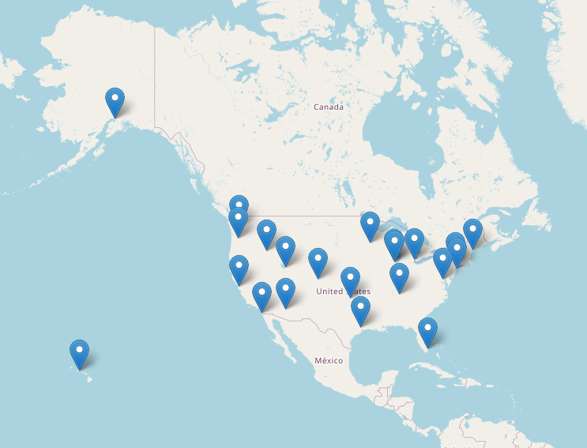
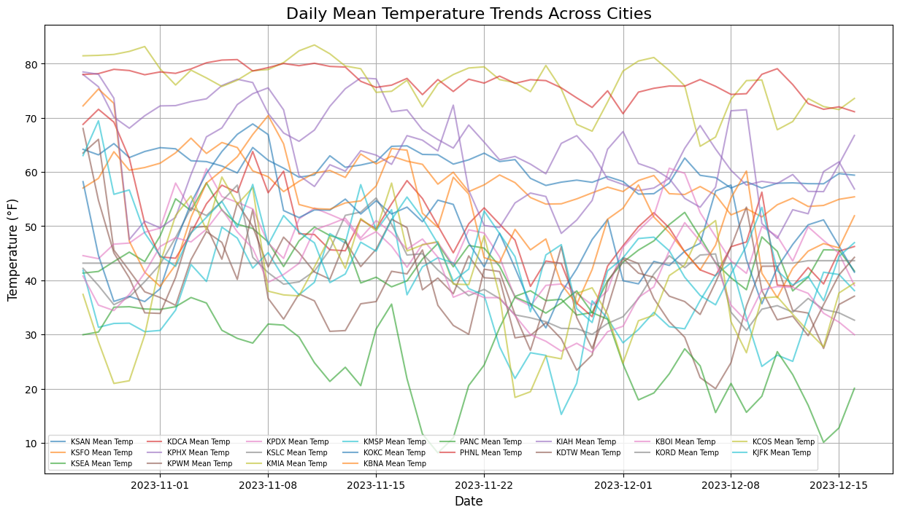
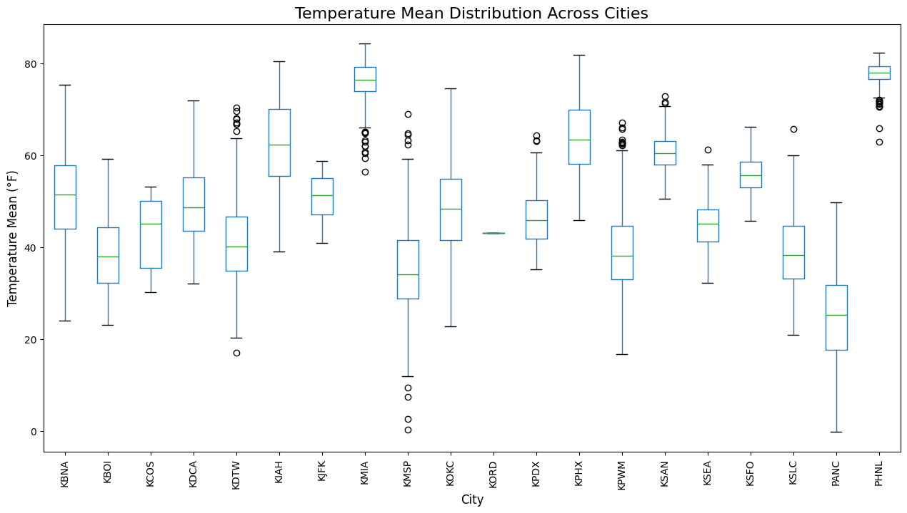
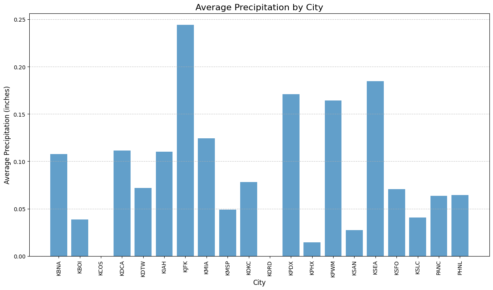
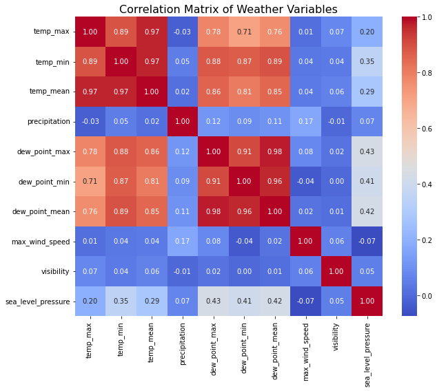
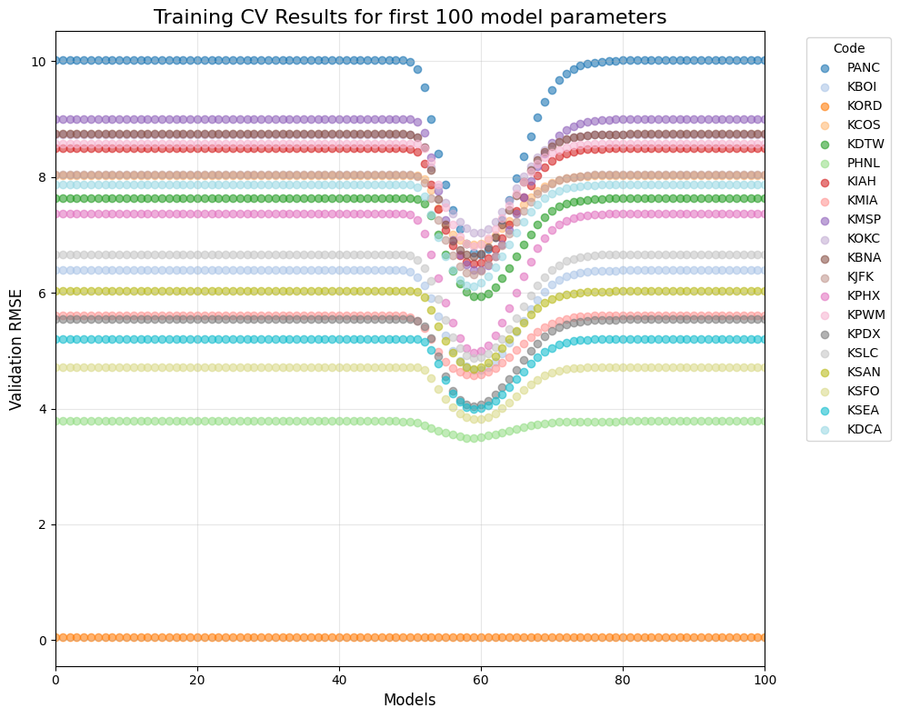
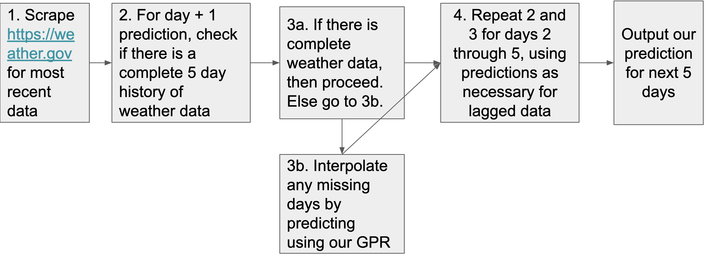
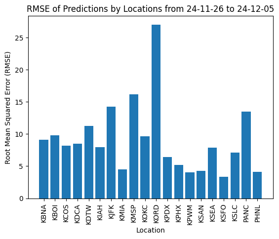
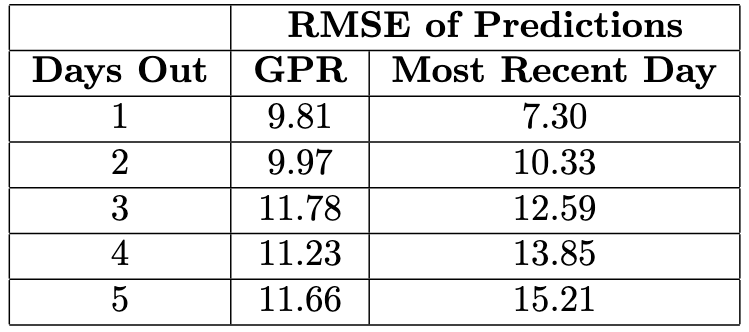

# Introduction

Weather forecasts are an important, yet often overlooked, luxury of the modern world. We can easily get relatively accurate weather forecasts for up to two weeks into the future. Traditionally, weather forecasts are built off of physics-based models which requires a large computation overhead. In this project, we explore the use of applying statistical methods instead of the traditional models applied. Our goal is to, as accurately as possible, provide 5 day forecasts for 20 airports across the United States. 

While it may be intuitive to leverage the plethora of historical weather data for all 20 locations, this probably isn't feasible given the time and computation for scraping data from the internet. Additionally, there are some self-imposed restrictions in terms of memory and computational costs associated with our prediction models. Through our project, by leveraging a relatively short period of historical data, we determine if statistical methods accurately and reliably forecast weather.

```{r airports,fig.align='center', echo=FALSE, fig.cap="Map of all 20 airport locations to be forecasted." , out.width = '60%'}

```

# Historical Data Collection

Weather is one of the most widely and longest collected forms of data. As such, there are plenty of reliable data sources which could aid in our project. We opted to scrape Weather Underground data using the package \textsc{RSelenium}. We collected historical weather data for our selected 20 locations across the United States, focusing on variables such as temperature, precipitation, dew point, wind speed, visibility and sea level pressure.
The extraction of historical weather data from the Weather Underground website was conducted using RSelenium, a browser automation tool that facilitated efficient scraping of the required information. Weather Underground was chosen as the data source because it provides ground truth data by the definition of our project, despite its use of Java-based elements, which make it more challenging to scrape. The code successfully collected information on location, date, high, low, and day-average temperatures, precipitation, dew point, wind speed, visibility, and sea level pressure. Spanning multiple locations and dates, the dataset offers a robust foundation for analyzing weather trends.

During the data collection process, a significant anomaly was identified on November 8, 2020, when no data was scrapable for any location with the current code. While the specific cause remains unclear and further investigation could clarify the issue, this was not pursued further. Notably, this date coincided with the announcement of the results of the 2020 U.S. presidential election, though the relevance of this timing is uncertain. Additionally, an examination of the data revealed occasional issues with missing values. On the Weather Underground platform, unrecorded hourly data was represented as zeros. For summary temperature metrics, this resulted in incorrect entries where high or low temperatures were recorded as zero, unless zero fell within the plausible range for the given day. Similarly, day-average temperatures appeared to incorporate zeros as placeholders for missing hourly data, leading to skewed averages.

These errors were identified through code errors and spot checking, but the code was not adjusted. Dates that could not be scrapped were skipped rather than attempted with a second set of scrapping code nested inside the first. Additionally, missing hourly data was not accounted for in the code as it would have taken the code identifying the issue, pulling information from the hourly table, correcting the affected values, and replacing them. While it was possible to add functionality to the code to address these issues, the short term nature of the project in conjunction with the low frequency of occurrence and ease of manual adjustments lead to the decision to apply corrections after the fact.

While the code worked very well, there was an issue applying it. The Chicago airport that we attempted to scrape did not have historical data leading to a scrapping error where the same data was pulled continuously. This led to a large error for Chicago. Similarly, the Denver airport of interest was not available for historical data. There were difficulties switching between the alternative city, BLANK City, for historical data to the proper Denver airport for updating data. These are issues that could have been minimized or corrected if identified earlier and is an area where we have room for improvement. 


# Exploratory Data Analysis

After compiling the data, we conducted an initial exploratory analysis to identify trends, patterns, and any potential anomalies that could influence our predictions.

The temperature trends and distributions vary significantly across cities, as observed in the daily temperature trend plot, Figure \@ref(fig:eda-mean-temp-trend), and the boxplot, Figure \@ref(fig:boxplot). For example, some cities, like San Francisco (KSFO) and Miami (KMIA), experience higher and more consistent temperatures, while others, like Minneapolis (KMSP), New York (KJFK) and Alaska (PANC) show much lower temperatures with relatively high variabilities. This suggests that city-specific models would be more effective than a generalized approach to capture regional weather patterns accurately.

```{r eda-mean-temp-trend, fig.align='center', echo=FALSE, out.width = '80%', fig.cap='my caption'}

```

```{r boxplot,fig.align='center', echo=FALSE, out.width = '80%', fig.cap= 'Boxplot of the mean temperature across the different cities.'}

```

In in the daily temperature trend plot (Figure \@ref(fig:eda-mean-temp-trend)) and the boxplot (Figure \@ref(fig:boxplot)), we can also see Chicago's data shows constant daily values, indicating potential data quality issues.

The precipitation barplot, Figure \@ref(fig:preception), highlights substantial differences in average precipitation across cities. For example, cities like Seattle (KSEA) has much higher average precipitation, consistent with its known rainy climates, while cities like Phoenix (KPHX) and San Diego (KSAN) exhibit minimal precipitation. These variations emphasize the need to model precipitation separately for each region.

```{r preception,fig.align='center', echo=FALSE, out.width = '80%', fig.cap='Average precipitation by city. High variability in precipitation with some citis with a lot of precipitation and other cities having no precipitation at all.'}

```

The correlation heatmap, Figure \@ref(fig:heatmap), highlights non-linear relationships between key weather variables, such as the strong correlation between dew point and temperature metrics but weaker or non-linear associations with precipitation and wind speed. This complexity supports the use of non-linear models for better predictive performance.

```{r heatmap, fig.align='center',echo=FALSE, out.width = '80%', fig.cap='Correlation matrix of all weather covariates available.'}

```

These findings guide the modeling approach, emphasizing the need for city-specific, non-linear models and careful handling of data inconsistencies.

# Methods

## Modeling Approach
As determined from the EDA section, we wanted to have a city specific model that was nonlinear due to the complex relationships in the data. Thus, we decided to use a Gaussian Process Regression (GPR) model. GPR does not assume a functional form (e.g. linear) form of the data, as the data is modeled as distributions of functions, which we found was perfect for our case. As we also were dealing with time series data, we also wanted a multi-output response to predict all of the predictors for a future date in order to extrapolate our predictions beyond just one day ahead predictions. GPR provides a nonparametric method for this task, and ideally, also comes with its own uncertainty quantification of its results. While this was something we did not take advantage of in our model, in future work, this is a direction we can focus on re-weight our predictions if we are not confident in it.

When using GPR, we are able to choose many different kinds of kernels. We ended up using a Radial Basis Function (RBF) kernel because while it is extremely smooth, this smoothness is able to capture the local dependence structure of our data that we will tune via cross validation as we will see. Thus, we had the following pipeline in mind. 

1. First, we will train on the historical weather data from October to December that we had. 
2. We will do hyperparameter tuning of the $\alpha$ parameter in GPR and and Length scale parameter in the RBF. 
3. We will use RMSE as our loss for training and we chose to use a Lag of 5 days (with some motivation of this number chose in the prediction section). 

## Cross-Validation Training

To do the task in point 2, we performed cross-validation training by using the `TimeSeriesSplit` from `scikit-learn`. In this `TimeSeriesSplit`, we chose to use 5 splits (6 total folds). Then for the iteration $k\in[5]$, we will use the first $k$ folds as our training set, and the remaining folds as our testing set. This means that for each successive iteration, our training set will be a super set of the previous iteration's training set. As alluded to before, the specific hyperparameters that we wanted to tune was the $\alpha$ parameter in GPR and $\ell$ which is the Length scale parameter in the RBF. 

For some high level understanding of what these parameters control, $\alpha$ used in GPR can be thought of as the variance of the Gaussian measurement noise on the training observations. We were tuning $\alpha$ on the log scale, from $10^{-12}$ to $10^{10}.$ As we are treating $\alpha$ as a scalar, we are assuming the data comes an isotropic multivariate Gaussian i.e. that the variance is homeostatic for a city, which is a reasonable assumption given our initial data exploration.

On the other hand, $\ell$ controls how the local versus global structure of our kernel is going to be. In other words, it determines how far the influence of a single data extends to. Smaller $\ell$ captures the more rapid sharp changes in the data, but larger $\ell$ tends to smooth out much of the peaks and fluctuation in the data. We also tuned $\ell$ in the log space to range from $10^{-5}$ to $10^5$. Thus, we had a final grid of hyper parameters in which we chose the pair that had the lowest validation RMSE. For all of the 20 models, we show an example of the cross validation training results below in Figure \@ref(fig:train-cv).

```{r train-cv, echo=FALSE, fig.align='center', fig.cap="Validation RMSE of the first 100 models tested for each city", out.width = '60%'}

```

Only 100 configurations of the hyperparameters are shown here, and we see that the all of the models generally minimize the RMSE at around the same hyperparameters (besides Chicago/KORD at the bottom). This pattern generally occurred at around every 80 iterations, though it was never minimized more than the model hyperparameters shown in Figure \@ref(fig:train-cv).

## Framework for Predictions
After training our models, we now needed a framework to make predictions for the next 5 days, as our model only outputs a prediction for a given day. Thus, we followed this framework:

```{r pred-framework, echo=FALSE, fig.align='center',fig.cap="Flowchart outlining the entire analysis pipeline for 5 day out prediction.", out.width = '90%'}

```

Notice that in the first step of this framework, we will only be scraping current data from \url{weather.gov}. On this site, only the most recent 3 days of weather history is given. As such, this motivated our use of using the 5 past days of history to predict the future, as if are predicting further out into the future, we will need to interpolate the days prior to 3 days before our desired data, so we wanted to maximize our use of current data while still trying to incorporate lagged data. 

# Results

Using our predictions from November 26th, 2024 to December 5h, 2024, the RMSE of all of predictions combined for each day was around 10.6. If remove Chicago from our results, our RMSE decreased to around 8.93. To see how well we did on each city, we plotted our results using on a per city basis in Figure \@ref(fig:rmse-cities). As we can see from this figure, we performed the worst when predicting Chicago's (KORD) weather. After Chicago, the next highest RMSEs were New York (KJFK), Minneapolis (KMSP), and Anchorage (KPANC). This makes sense as the winter storm that occurred during Thanksgiving should have affected our predictions.

```{r rmse-cities, echo=FALSE, fig.align='center',fig.cap="\\label{fig:RMSE_cities}RMSE of Predictions from November 26th to December 5th.", out.width = '90%'}

```

On the other hand, our model performed quite well with cities like Miami (KMIA), Portland (KPWM), and San Francisco (KSFO). This coincides with pre-existing knowledge that these cities are quite stable in climate and weather (at least temperature wise) as these are quite attractive places to go during the winter.

Beyond just looking at predictions at a city level, we also compared our predictions with the naive method of just using the previous day to predict 1 through 5 days out in Figure \@ref(fig:rmse-days).

```{r rmse-days, echo=FALSE, fig.align='center',fig.cap="RMSE of Predictions based on how far out they were.", out.width = '70%'}

```

We can see from this figure that besides 1 Days out, our model had a lower RMSE in our predictions than using the naive method. This suggests that for longer term predictions, a naive method of using the most recent day to predict is not as beneficial as our model. However, we do note that the sample variance of SSE over all models suggests that there potentially is not much of a distinction between the two methods.

# Conclusion
Looking at the prediction results, we had significant issues with the cities Chicago and Denver. The reason for this is due to mismatch errors between airports. For Denver, KDEN does not have any historical data recorded on Weather Underground so as an alternative we pulled in historical data from a nearby airport in Colorado Springs. However, when we are pulling in current data, on \url{weather.gov} we can successfully pull data for KDEN but there was a mismatch between airport names so we predicted the same temperature for every single day past 11/25. Similarly for Chicago, the historical data was KORD but the current data is pulling from a different smaller airport in Chicago. Once these errors are fixed, there will be an improvement for our prediction results. 

For future improvements of our project, perhaps we were too optimistic with using only historical data for the months of October to December. It's very likely that we did not capture any long term weather patterns that could help us with predictions. In addition, the implementation of the Gaussian process regression in sklearn treats multi-output responses as independent of one another and perhaps looking at an alternative implementation may improve our results. One major thing that we would reconsider is to possibly assimilate more observational data from sources that are more easily accessible through simple Python packages. Although working with data from Weather Underground has certain advantages, it has its own difficulties in scraping. Other weather data sources such as open-meteo have data that is much more easily accessible. Additionally, having a 0.1 to 1 degree difference compared to Weather Underground will most likely not have a significant impact on the prediction results. Lastly, our data never updates past November 25th and we used an interpolation method to fill in missing dates, which may not the best approach. Ideally, we would store the current data that is being pulled each day instead of doing an interpolation technique. 


\newpage
\noindent


# Code Appendix


## EDA
```{python, file='appendix/2-eda.py', echo = T, eval = F}
```


## Model Training

```{python, file='appendix/3-model_train.py', echo = T, eval = F}
```


## Model Predict 

```{python, file='appendix/4-model_predict.py', echo = T, eval = F}
```
